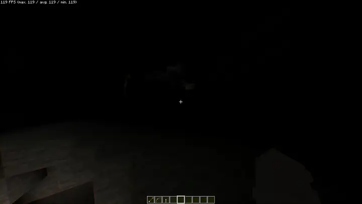

# Torches

Stone torches and torch arrows for cave adventures

## Stone Torch

A torch made with stone sticks instead of wooden ones. Functionally identical to a vanilla torch just made from stone.

- **Stone Stick**: 2 cobblestone → 4 stone sticks
- **Stone Torch**: coal/charcoal + stone stick → 4 stone torches

## Torch Arrow

An arrow tipped with a lit torch. On impact it places a torch on the surface it hits (ground or wall) and applies a brief moment of fire damage to any entity struck.

- **Crafting**: arrow + torch → 1 torch arrow
- **Fletching Table**: arrow + torch → 4 torch arrows (requires [The Fletching Table](https://modrinth.com/mod/thefletchingtable))

Works with bows and crossbows.

## Configuration

Settings are in `torches-common.toml` or accessible via the in-game config screen.

| Setting | Default | Description |
|---------|---------|-------------|
| Fire on Hit | `true` | Torch arrows briefly ignite entities on impact |
| Dynamic Lights | `true` | Torch arrows emit dynamic light in flight (requires a dynamic lights mod) |

## Compatibility

- Requires NeoForge 1.21.1 (21.1.219+)
- [The Fletching Table](https://modrinth.com/mod/thefletchingtable) (optional) -- higher-yield fletching table recipe
- [Sodium Dynamic Lights](https://modrinth.com/mod/sodium-dynamic-lights) (optional) -- torch arrows glow in flight, stone torches glow when held

## License

GPL-3.0-or-later
